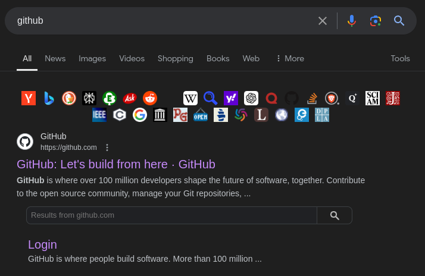

Adds icons to Google results for quick access to other search engines and resources.

## Installation

1. Install a userscript manager (e.g., Tampermonkey).
2. Create a new script and paste the code.
3. Save and enable the script.
